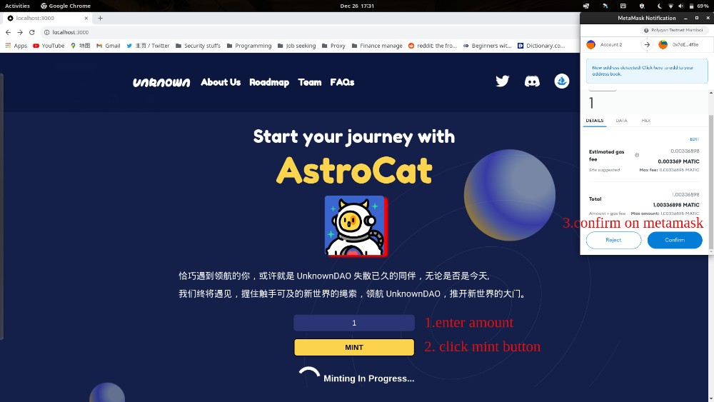
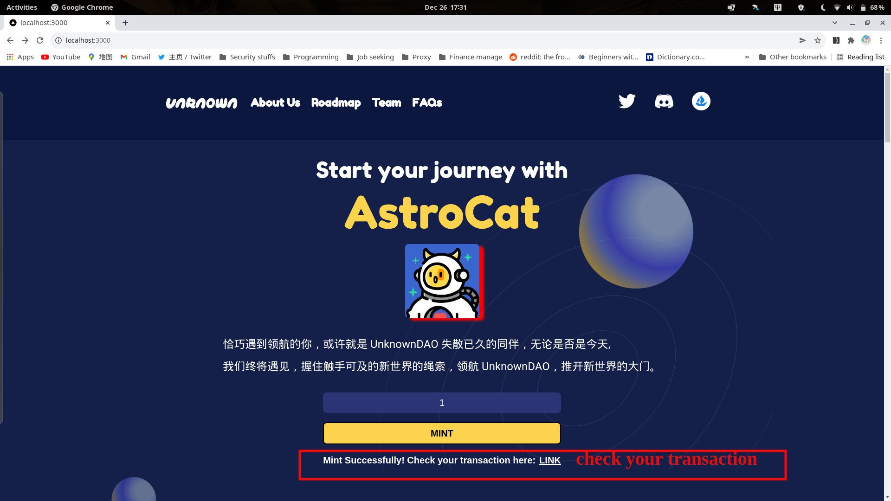

This is a [Next.js](https://nextjs.org/) project bootstrapped with [`create-next-app`](https://github.com/vercel/next.js/tree/canary/packages/create-next-app).
## Overview
This is a NFT saling **TEST** website for UnknownDAO. Before you mint a NFT, make sure that you have at least 2 matic in your wallet for minting 1 NFT.  **Live demo**: [livedemo](https://jovial-colden-c28f41.netlify.app/)  
- View our AstroCat NFT at opensea: https://opensea.io/collection/astrocattokens          
- Contract address in polygon testnet:[Address](https://mumbai.polygonscan.com/address/0x7de72ea18b27cdc91a152e682816cab6cd744f3e).                                 

## Features
Simple NFT minting website


                               

## Getting Started
First, install all the dependencies needed:
```
yarn install
```
Second, run the development server:

```bash
npm run dev
# or
yarn dev
```

Open [http://localhost:3000](http://localhost:3000) with your browser to see the result.

You can start editing the page by modifying `pages/index.js`. The page auto-updates as you edit the file.

[API routes](https://nextjs.org/docs/api-routes/introduction) can be accessed on [http://localhost:3000/api/hello](http://localhost:3000/api/hello). This endpoint can be edited in `pages/api/hello.js`.

The `pages/api` directory is mapped to `/api/*`. Files in this directory are treated as [API routes](https://nextjs.org/docs/api-routes/introduction) instead of React pages.

## Learn More

To learn more about Next.js, take a look at the following resources:

- [Next.js Documentation](https://nextjs.org/docs) - learn about Next.js features and API.
- [Learn Next.js](https://nextjs.org/learn) - an interactive Next.js tutorial.

You can check out [the Next.js GitHub repository](https://github.com/vercel/next.js/) - your feedback and contributions are welcome!

